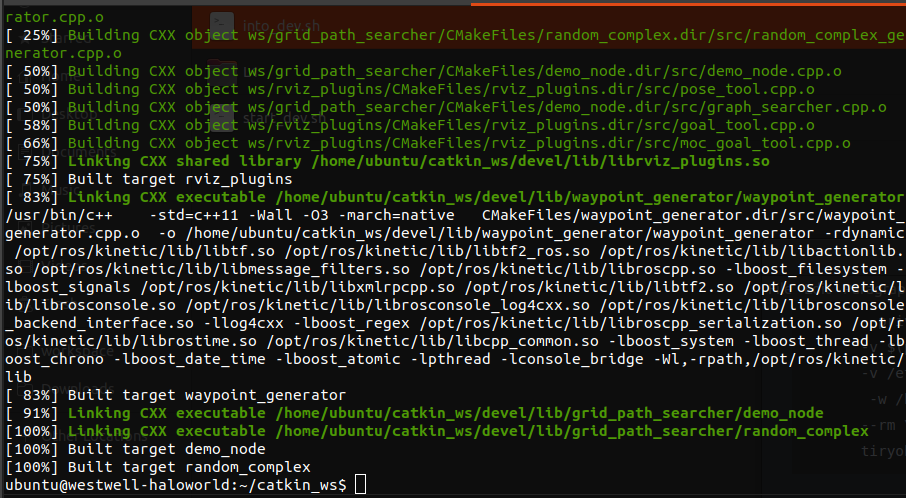
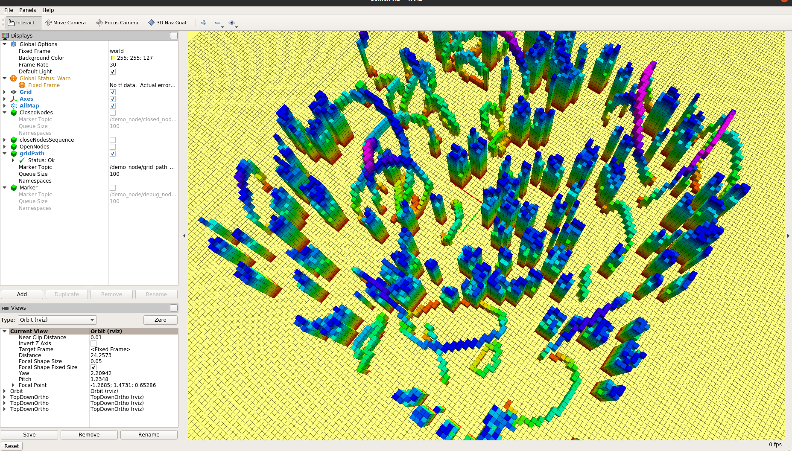

MotionPlanning L1

### 环境安装

1. 选用docker的方式部署环境，找了一个网上可用的ubuntu16+ros-kinetic镜像

   docker 镜像：[tiryoh/ros-kinetic-desktop：base](https://hub.docker.com/r/tiryoh/ros-kinetic-desktop/)

2. 添加容器启动与进入容器脚本（脚本详见./L1/code/src）

   - 容器启动脚本（start_dev.sh）, 将样例代码挂在到catkin_ws工作空间上

```start_dev.sh
!/bin/bash
VERSION="0.01"
ContainerName=ros2ubuntu16

#kill and rm exsit container
docker stop $ContainerName > /dev/null 2>&1
docker rm -f $ContainerName > /dev/null 2>&1

#CURRENT_FILE_PATH=$(dirname $(dirname "$PWD"))

docker run -it \
    -d \
    --name $ContainerName \
    --net=host \
    -e DISPLAY=unix$DISPLAY \
    -v /tmp/.X11-unix:/tmp/.X11-unix:rw \
    --privileged \
    -v $(pwd):/ws \
    -v /etc/localtime:/etc/localtime \
     -w /home/ubuntu/catkin_ws \
    --rm \
    tiryoh/ros-kinetic-desktop:base
```

- 容器进入脚本：

```bash
#!/bin/bash

docker exec -it -e LANG=C.UTF-8 ros2ubuntu16 /bin/bash
```

### 编译样例代码

```bash
./into_dev.sh
catkin_make
```

1. 编译结果如下

   

### 样例执行

按照作业提示中说明分别运行，roscore, rviz及grid_path_searcher三个模块，可以成功运行：



